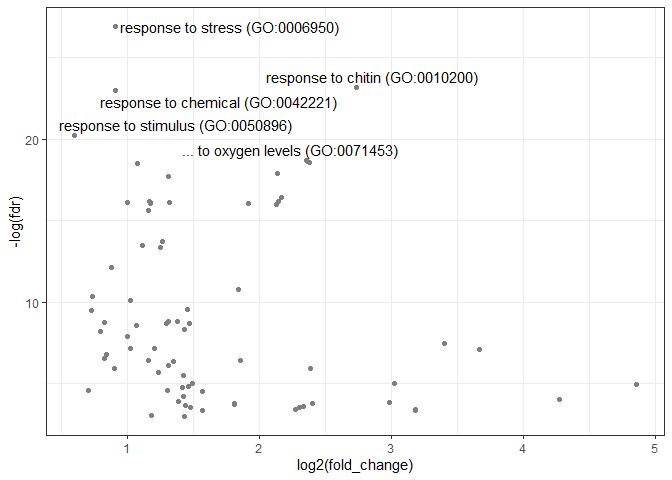
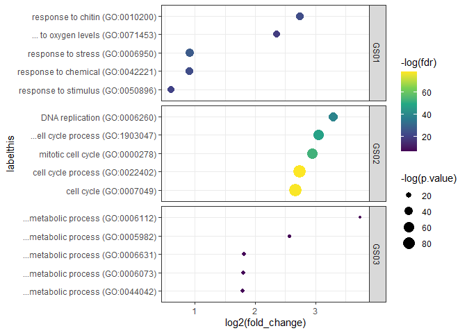

Lukas Muenter
27 7 2021

# oracl 

NOTE: Currently, this package does only accept AGI-codes (*A.
thaliana*). This will change, however.

## Overview

This package provides a client for GO-Term enrichment via the API of
[`PANTHER`](http://pantherdb.org/). It takes a `vector` of gene IDs,
sends it to `PANTHER`, and reformats the response into a handy
`dataframe`. This `dataframe` also includes gene IDs, which are
associated to the GO-Term in question.

## Installation

    # install from github
    devtools::install_github("lmuenter/oracl")

## Usage

In this example, we’d like to identify overrepresented GO-Terms for an
example dataset provided with the package. Note, that we specify the
*Biological Process* ontology by setting `ont = bp` in
`oracl::oraclient()`. Other options are of course `ont = mf` (Molecular
Function) and `ont = cc` (Cellular Component).

    ## [1] "[oraclient] Overrepresentation test. Ontology: bp, taxon: Athaliana, FISHER test and FDR correction. P-threshold is 0.05, FDR threshold is 0.05."

    ## Joining, by = "GO_ID"

## Advanced Usage

### Plot results as Volcano Plot

``` r
# Load Packages
library(ggplot2)

# Make a plot
volcano.p = volcanoracl(bp.df)

# The plot `volcano.p` is a ggplot-object.
# We can change its attributes!
volcano.p + scale_colour_manual(values = "steelblue")
```

<!-- -->

### Using `{oracl}` with a list of genesets

When several genesets should be inferred, it may be handy to combine
overrepresented terms in one dataframe. This is especially useful for
plotting.

``` r
# obtain a list of genesets
gs.ls <- list(
    oracl:::GS01,
    oracl:::GS02,
    oracl:::GS03
)

# get background geneset
bg <- oracl:::background

# set names of list elements (vital for later)
names(gs.ls) <- c("GS01", "GS02", "GS03")

# get overrepresented GO-terms
bp.ls = lapply(gs.ls, oraclient, 
    bg = bg,
    ont = "bp",
    fdr.thresh = 0.05
)
```

    ## Joining, by = "GO_ID"
    ## Joining, by = "GO_ID"
    ## Joining, by = "GO_ID"

``` r
# get ONE dataframe (ID-column `grouping` specifies the geneset)
bp.ls.df <- oracl_list_to_df(bp.ls)
```

### Make a facetted dotplot (One facet per group)

We can now plot overrepresented GO-Terms using group information in the
column `bp.df$grouping`. We can either make a facetted dotplot:

``` r
oraclot(bp.ls.df, top_n = 20) + scale_color_viridis_c()
```

<!-- -->

Or we can make a facetted volcano plot:

``` r
volcanoracl(bp.ls.df, top_n = 20)
```

<!-- -->

## Limitations

1.  **Gene IDs and Organism**. Currently, only *Arabidopsis thaliana*
    (L.) Heynh. can be investigated.

2.  **Cognate genes**. in order to save resources, the API of `PANTHER`
    does not report gene sets back (personal communication). Gene IDs
    reported by `{oracl}` are therefore only approximations. In essence,
    the underlying geneset is semantically compared to a
    gene-to-GO-term-dataset for every enriched GO-Term. These datasets
    are included in `{oracl}` (see `oracl/data/goterms`). Datasets have
    been generated by conducting ORA using the PANTHER website with
    *all* available AGI codes. To obtain necessary datasets, all results
    (without Bonferroni Correction) were exported to .json, parsed, and
    reformated.

## Upcoming Functionality

1.  Functions for automated plotting.

2.  Make other organisms available.

3.  Implement redundancy removal using
    [`{rrvgo}`](https://bioconductor.org/packages/release/bioc/html/rrvgo.html)

4.  Automate gene-symbol mapping using
    [`{org.At.tair.db}`](https://bioconductor.org/packages/release/data/annotation/html/org.At.tair.db.html)
